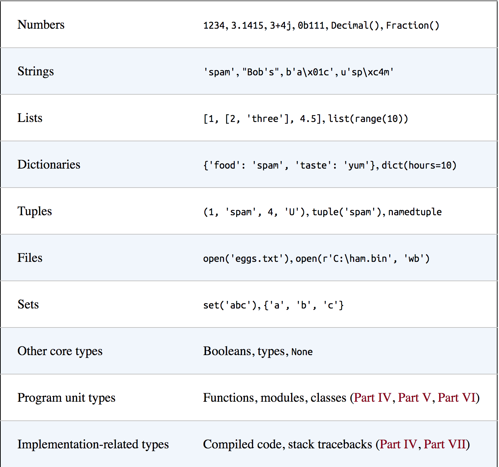

class: center, middle

#Data Types

---

###Core Data Types

.center[]
---

###Numbers

* The two most common Python number types are integers (ints) and floating point (floats)

--

* There are also complex numbers, fixed decimals and rationals

---

###Operations

* You can add (+), subtract (-), multiply (\*), divide (/), exponentiate(\*\*) numbers

--

* There is also integer division (//) and the modulus operator (%)

--

* Division is works slightly different in Python 2 and Python 3

--
* Python 2
```
>>> 2/4
0
>>> 3/2
1
>>> 2/4.0
0.5
```

--

* Python 3
```
>>> 2/4
0.5
>>> 3/2
1.5
>>> 2/4.0
0.5
```

---

### math module

```
>>> import math
>>> math.pi
3.141592653589793
>>> math.sqrt(110)
10.488088481701515
```

--

```
>>> help(math)

Help on module math:

NAME
    math

FILE
    /Users/andrewquitadamo/anaconda/lib/python2.7/lib-dynload/math.so

MODULE DOCS
    https://docs.python.org/library/math

DESCRIPTION
    This module is always available.  It provides access to the
    mathematical functions defined by the C standard.

FUNCTIONS
    acos(...)
        acos(x)
        
        Return the arc cosine (measured in radians) of x.

```
---

###Strings

* Generally strings are a collection of text

--

* Technically they are a collection of bytes

--

* String Basics
```
>>> S = 'Spam'
>>> len(S)
4
```

--

* Indexing 
```
>>> len(S)
4
>>> S[0]
'S'
>>> S[-1]
'm'
>>> S[-2]
'a'
```

--

* Indexing starts at 0

---

###Strings (cont.)

* Slicing
```
>>> S[1:3]
'pa'
>>> S[1:4]
'pam'
>>> S[1:]
'pam'
>>> S[0:3]
'Spa'
>>> S[:3]
'Spa'
```

--

* Concatenation
```
>>> S + 'alot'
'Spamalot'
>>> S
'Spam'
>>> S*8
'SpamSpamSpamSpamSpamSpamSpamSpam'
```

--

* The `+` for numbers is addition but for strings it is concatenation. This is an example of polymorphism which we will discuss more when we get to OO

---

###Immutability

--
```
>>> S[0]='s'
Traceback (most recent call last):
File "<stdin>", line 1, in <module>
TypeError: 'str' object does not support item assignment
```

--

* Numbers, strings and tuples are immutable

--

* Lists and dictionaries are mutable

--

* You can save the results of a string operation by reassigning back to the variable
```
>>> S = S + 'alot'
>>> S
'Spamalot'
```

---

###String Specific Methods

--
```
>>> S.find('pa')
1
>>> S.replace('pa','LA')
'SLAm'
>>> S
'Spam'
```

--
```
>>> line = 'BI_GS_DEL1_B5_P2682_257\tENSG00000188000.2\t-50.0350478013566\t  
2.19054140417393e-184\t3.06305595087044e-179\t-0.242246304080066'
>>> line.split('\t')
['BI_GS_DEL1_B5_P2682_257', 'ENSG00000188000.2', '-50.0350478013566',  
'2.19054140417393e-184', '3.06305595087044e-179', '-0.242246304080066']
>>> line.split()
['BI_GS_DEL1_B5_P2682_257', 'ENSG00000188000.2', '-50.0350478013566',  
'2.19054140417393e-184', '3.06305595087044e-179', '-0.242246304080066']
```
--

* Escaped characters `\t` is tab, `\n` is newline, `\r` is carriage return, `\\` is backslash

---

### String Specific Methods (cont.)

```
>>> S.upper()
'SPAM'
>>> S.lower()
'spam'
>>> S.isalpha()
True
```

--
```
>>>line = 'BI_GS_DEL1_B5_P2682_257\tENSG00000188000.2\t-50.0350478013566\t  
2.19054140417393e-184\t3.06305595087044e-179\t-0.242246304080066\n'
>>> line.rstrip()
'BI_GS_DEL1_B5_P2682_257\tENSG00000188000.2\t-50.0350478013566\t  
2.19054140417393e-184\t3.06305595087044e-179\t-0.242246304080066'
```

--
```
line.rstrip().split()
['BI_GS_DEL1_B5_P2682_257', 'ENSG00000188000.2', '-50.0350478013566',  
'2.19054140417393e-184', '3.06305595087044e-179', '-0.242246304080066']
```

---

###Unicode

* Python 2 and Python 3 handle unicode differently

--

* Python 2
```
>>> S = 'sp\xc4m'
>>> S
'sp\xc4m'
```

--

* Python 3
```
>>> S = 'sp\xc4m'
>>> S
'spÄm'
>>> S = '\U0001f62c \U0001f60e hello'
>>> S
'😬 😎 hello'
```

---

###Pattern Matching

* `re` module

--
```
>>> S = 'Spam'
>>> re.search('pa',S)
<_sre.SRE_Match object; span=(1, 3), match='pa'>
```

--

* We will cover regular expressions in lab next week

---

###Lists

* Lists are ordered collections

--

* They can contain different data types

--

* Lists are mutable, and can be modified in place

--
```
>>> L = [1,2,3,'a','b']
>>> L
[1, 2, 3, 'a', 'b']
```

--
```
>>> L[0]
1
```

--
```
>>> L[3:]
['a', 'b']
```

--
* List bounding issues
```
>>> L[100]
Traceback (most recent call last):
File "<stdin>", line 1, in <module>
IndexError: list index out of range
```

--
```
>>> L[100]=98
Traceback (most recent call last):
File "<stdin>", line 1, in <module>
IndexError: list assignment index out of range
```

---

### List Nesting

* Lists can contain lists

--
```
>>> L = [[1,2,3],[4,5,6],[7,8,9]]
>>> L
[[1, 2, 3], [4, 5, 6], [7, 8, 9]]
```

--

* Indexing Nested Lists
```
>>> L[0]
[1, 2, 3]
```

--
```
>>> L[0][2]
3
```

---

### Comprehensions

* List comprehensions can build new lists by processing another list

--
```
>>> [row[1] for row in L]
[2, 5, 8]
>>> [row[1]*2 for row in L]
[4, 10, 16]
```

--

* You can use `if` statements with list comprehensions
```
>>> [row[1]*2 for row in L if row[1] % 2 == 0]
[4, 16]
```

---

###Generators

* A generator is an expression that produces results when called

--
```
>>> G = (sum(row) for row in L)
>>> next(G)
6
>>> next(G)
15
>>> next(G)
24
>>> next(G)
Traceback (most recent call last):
File "<stdin>", line 1, in <module>
StopIteration
```

--

* The `map` function can apply a function to every element in a list
```
>>> list(map(sum,L))
[6, 15, 24]
```

--

* In Python 2 the `list()` surrounding the `map` isn't necessary

---


