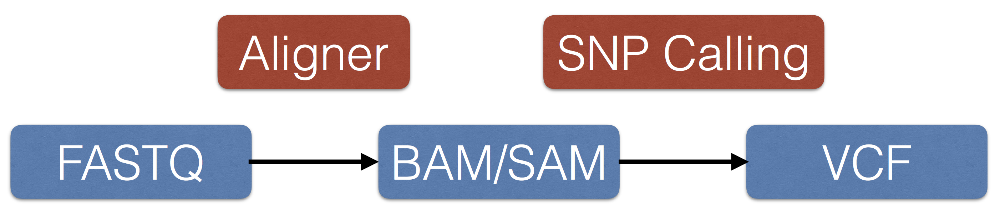

class: center, middle

#Bioinformatics File Formats

---

##The NGS Workflow

.center[]

---

#FASTQ

* Fastq files represent reads from sequencers

--

```
@EAS54_6_R1_2_1_413_324
CCCTTCTTGTCTTCAGCGTTTCTCC
+
;;3;;;;;;;;;;;;7;;;;;;;88
```

--

```
@<identifier and other information>
<sequence>
+<identifier and other information OR empty string>
<quality>
```

---

##SAM/BAM Files

* SAM files represent aligned reads

--

* BAM files are binary SAM files

--

* CRAM files are a compressed version of BAM

---

##SAM Files

* Tab delimited with 11 mandatory fields, and a variable number of optional fields

--

* They can have an optional header that starts with `@`

--

* The 11 fields are `QNAME`, `FLAG`, `RNAME`, `POS`, `MAPQ`, `CIGAR`, `RNEXT`, `PNEXT`, `TLEN`, `SEQ`, and `QUAL`

---

##SAM Header

* Begins with `@` and followed by two-letter codes in a TAG:VALUE format

--

* `@HD` the header line

--

* `VN` - version number

--

* `SO` - sorting order

--

```
@HD     VN:1.0  SO:coordinate
```

---

##SAM Header (cont.)

* `@SQ` is the reference sequence dictionary

--

* `SN` - Reference Sequence Name

--

* `LN` - Reference Sequence Length

--

* `M5` - MD5 Hash

--

* `UR` - URI of genome sequence

--

* `AS` - Genome assembly identifier

--

* `SP` - Species

--

```
@SQ     SN:1    LN:249250621    M5:1b22b98cdeb4a9304cb5d48026a85128    
UR:ftp://ftp.1000genomes.ebi.ac.uk/vol1/ftp/technical/reference/\
phase2_reference_assembly_sequence/hs37d5.fa.gz        
AS:NCBI37       SP:Human
```

---

##SAM Header (cont.)

* `@RG` is the Read Group

--

* `ID` is the read group ID, which must be unique

--

* `LB` is the library

--

* `SM` is the sample

--

* `PI` is the predicted median insert size

--

* `CN` is the center

--

* `PL` is the platform

--

* `DS` is the description

--

```
@RG     ID:SRR062634    LB:2845856850   SM:HG00096      PI:206  CN:WUGSC
PL:ILLUMINA     DS:SRP001294

@RG     ID:SRR062635    LB:2845856850   SM:HG00096      PI:206  CN:WUGSC
PL:ILLUMINA     DS:SRP001294
```

---

#SAM Header(cont.)

* `@PG` - Program

--

* `ID` - program id

--

* `PN` - program name

--

* `CL` - command line command that ran the program

--

* `VN` - version number

--

```
@PG     ID:bwa_index    PN:bwa  VN:0.5.9-r16    CL:bwa index -a bwtsw $reference_fasta
@PG     ID:bwa_aln_fastq        PN:bwa  PP:bwa_index    VN:0.5.9-r16    CL:bwa aln -q 15 -f $sai_file $reference_fasta $fastq_file
```

---

#SAM Record

```
QNAME   FLAG    RNAME  POS MAPQ    CIGAR   RNEXT   PNEXT   TLEN    SEQ QUAL
SRR062634.8174669   99  11  60010   0   100M    =   60060   149 
TTTAGAAAAATAAACCATAGCCTCATCACAGGCACTTAAATACACTGAAGCTGCCAAAACAATCTATCGTTTTGCCTACGTACTTATCAACTTCCTCATA    
0JKKOEP=JJOOQNPCRPPQQRRQRPQRPHKLQRPRP?QLPJPRPJQQRGMJGQQJIIRPR<?QRHIL=I@IMIHHJHG@<I@GJAEAGFHF?D?E@@A?    
X0:i:10 X1:i:0  MD:Z:0A99   RG:Z:SRR062634  AM:i:0  NM:i:1  SM:i:0  MQ:i:0  XT:A:R  
BQ:Z:C[Y@@@@@@@@@@@@@@@@@@@@@@@@@@@@@@@@@@@@@@@@@@@@@@@@@@@@@@@@@@@@@@@@@@@@@@@@@@@@@@@@@@@@@@@@@@@@@@@@@
```

---

#SAM Flags

* The SAM flags contain information about whether the segment is mapped, reverse complemented, and properly aligned among other information

--

* All of this is packed in bitwise manner, and represented as a single integer

--

[https://broadinstitute.github.io/picard/explain-flags.html](https://broadinstitute.github.io/picard/explain-flags.html)

---

#CIGAR String

* The CIGAR string indicates how the sequence aligned to the template

--

* `M` is an alignment match

--

* `I` is insertion

--

* `S` is soft clipping

--

* `H` is hard clipping

--

* `X` is sequence mismatch

--

```
SRR062634.8174669   99  11  60010   0   100M    =   60060   149 
TTTAGAAAAATAAACCATAGCCTCATCACAGGCACTTAAATACACTGAAGCTGCCAAAACAATCTATCGTTTTGCCTACGTACTTATCAACTTCCTCATA    
0JKKOEP=JJOOQNPCRPPQQRRQRPQRPHKLQRPRP?QLPJPRPJQQRGMJGQQJIIRPR<?QRHIL=I@IMIHHJHG@<I@GJAEAGFHF?D?E@@A?    
X0:i:10 X1:i:0  MD:Z:0A99   RG:Z:SRR062634  AM:i:0  NM:i:1  SM:i:0  MQ:i:0  XT:A:R  
BQ:Z:C[Y@@@@@@@@@@@@@@@@@@@@@@@@@@@@@@@@@@@@@@@@@@@@@@@@@@@@@@@@@@@@@@@@@@@@@@@@@@@@@@@@@@@@@@@@@@@@@@@@@
```

---

#Samtools

* Samtools is one way to access and manipulate SAM and BAM files

--

* You can download Samtools from [Github](http://www.htslib.org/download) and simply follow the install instructions on the download page

--

* Samtools is also installed on the cluster. To load into you environment use
```
module load samtools
```

--

* `samtools view filename.bam` displays the entire SAM file without the header

--

* `samtools view -h filename.bam` displays the SAM file with the header

--

* You can also specify a region to extract reads from

```
samtools view HG00096.chrom11.ILLUMINA.bwa.GBR.low_coverage.20120522.bam "11:60000-80000"
```

--

* *Note*: I downloaded the BAM file from [ftp://ftp.1000genomes.ebi.ac.uk/vol1/ftp/phase3/data/HG00096/alignment/HG00096.chrom11.ILLUMINA.bwa.GBR.low_coverage.20120522.bam](ftp://ftp.1000genomes.ebi.ac.uk/vol1/ftp/phase3/data/HG00096/alignment/HG00096.chrom11.ILLUMINA.bwa.GBR.low_coverage.20120522.bam)

---

#Other Samtools Functions

* Samtools can calculate summary statistics for an entire SAM/BAM file or a region

```
samtools stats HG00096.chrom11.ILLUMINA.bwa.GBR.low_coverage.20120522.bam "11:60000-800000"
# This file was produced by samtools stats (1.6+htslib-1.6) and can be plotted using plot-bamstats
# This file contains statistics for all reads.
# The command line was:  stats HG00096.chrom11.ILLUMINA.bwa.GBR.low_coverage.20120522.bam 11:60000-800000
# CHK, Checksum	[2]Read Names	[3]Sequences	[4]Qualities
# CHK, CRC32 of reads which passed filtering followed by addition (32bit overflow)
CHK	863cad35	34b938f0	a97108de
# Summary Numbers. Use `grep ^SN | cut -f 2-` to extract this part.
SN	raw total sequences:	34815
SN	filtered sequences:	0
SN	sequences:	34815

...

```

---

#Samtools depth

* You can use `samtools depth` to calculate and display the number of reads at each position

--

```
samtools depth HG00096.chrom11.ILLUMINA.bwa.GBR.low_coverage.20120522.bam -r "11:60000-65000"
11	60010	1
11	60011	1
11	60012	1
11	60013	1
11	60014	1
11	60015	1
11	60016	2
...
11	64995	1
11	64996	1
11	64997	1
11	64998	1
11	64999	1
11	65000	1
```

---

##Samtools fastq/fasta

* You can convert a BAM file back to a fastq/a file using the `samtools fastq` command

```
samtools fastq HG00096.chrom11.ILLUMINA.bwa.GBR.low_coverage.20120522.bam | head
@SRR062634.8174669/1
TTTAGAAAAATAAACCATAGCCTCATCACAGGCACTTAAATACACTGAAGCTGCCAAAACAATCTATCGTTTTGCCTACGTACTTATCAACTTCCTCATA
+
0JKKOEP=JJOOQNPCRPPQQRRQRPQRPHKLQRPRP?QLPJPRPJQQRGMJGQQJIIRPR<?QRHIL=I@IMIHHJHG@<I@GJAEAGFHF?D?E@@A?
@SRR062635.20101367/2
AAAATAAACCATAGCCTCATCACAGGCACTTAAATACACTGAAGCTGCCAAAACAATCTACCGTTTTGCCTACGTACTTATCAACTTCCTCATAGCAAAC
+
0LMMMMOONPPNNPPQQPQOPQOQQRQQPRPPQQPPPQPRQQQQQRQQQRRRQPRRHKRPPIHILHHRMIJHH?EHMKHHI?KIHDIEGI@FEEDEFDDB
@SRR062634.8174669/2
TTTTGTGGCTATCATTTTATTCATTCCATTGCTTTTTTCTCCCAGTTTGCTATGAGGAAGTTGATAAGTACGTAGGCAAAACGATAGATTGTTTTGGCAG
```

---

##Resources

* [SAM File Specification](https://samtools.github.io/hts-specs/SAMv1.pdf)

* [Samtools Documentation](http://www.htslib.org/doc/samtools.html)
